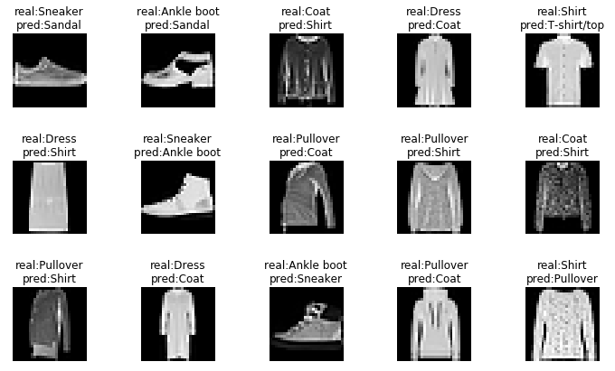

# Homework for deep machine learning course

## Tasks

### hw01

* Implementation of optimization methods with pytorch
* Implementation of simple fully-convolutional neural architecture for classification with pytorch
  * [FashionMNIST](https://github.com/zalandoresearch/fashion-mnist) dataset are used for train
  * An example of network misclassification after training:
  

### hw02

[ResNeXt](https://arxiv.org/abs/1611.05431) pytorch implementation with training on FasionMNIST dataset

### hw03

Skip Gram Negative Sampling pytorch implementation 

### hw8_9

#### DCGAN 
[DCGAN](https://arxiv.org/abs/1511.06434) pytorch implementation with training on CIFAR10 dataset

Generating examples after traning:

### VAE

VAE pytorch implementation with training on FashionMNIST dataset

Latent space representation after training: 

 

## Train datasets

### FashionMNIST

[FashionMNIST](https://github.com/zalandoresearch/fashion-mnist) dataset: 

### CIFAR10

[CIFAR10](https://www.cs.toronto.edu/~kriz/cifar.html) datasets:

