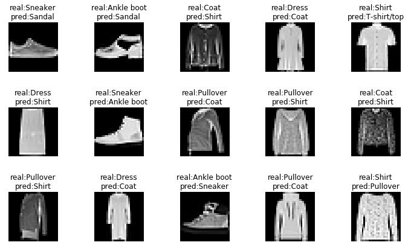

### task 1 : Optimization methods
Implementation of different optimization methods 
* Gradient descent with momentum
* Nesterov's accelerated gradient
* Adam algorithm

### task 2 : Neural network basics
* Implementation simple fully-convolutional neural architecture for classification
* Train on [FashionMNIST](https://github.com/zalandoresearch/fashion-mnist) dataset
* An example of network misclassification after training:
