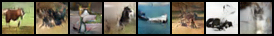
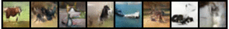
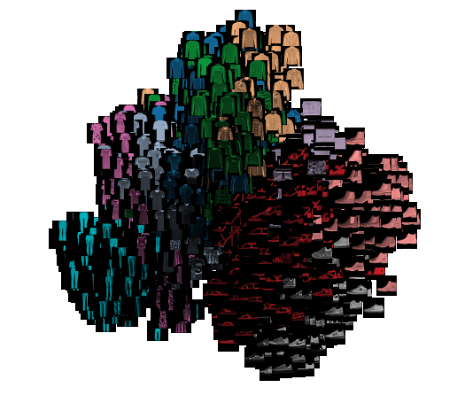

# DCGAN and VAE pytorch implementation  

-----------

⚠️ Get `tensorboard_data` folder here: [link](https://www.dropbox.com/s/mkvcybytdxllo76/tensorboard_data.zip?dl=0) ⚠️

-----------

* DCGAN paper:  [Distributed Representations of Words and Phrases and their Compositionality](https://arxiv.org/abs/1511.06434)

from [github](https://github.com/znxlwm/pytorch-MNIST-CelebA-GAN-DCGAN/)
 

* tranning on CIFAR10:

generated example:
 

* VAE picture:

* tranning on FashionMNIST

 

