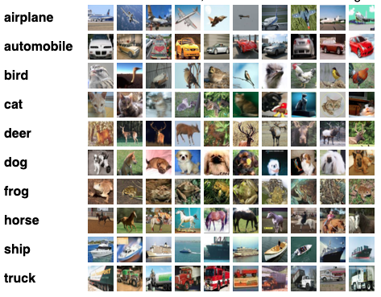

# DCGAN and VAE pytorch implementation  

-----------

Get `tensorboard_data` folder here: [link](https://www.dropbox.com/s/mkvcybytdxllo76/tensorboard_data.zip?dl=0)

-----------
## DCGAN
DCGAN paper:  [Distributed Representations of Words and Phrases and their Compositionality](https://arxiv.org/abs/1511.06434)

### Implementation details
from [github](https://github.com/znxlwm/pytorch-MNIST-CelebA-GAN-DCGAN/)
 

### Train dataset 

Training on [CIFAR10](https://www.cs.toronto.edu/~kriz/cifar.html):

### Result:
Generating examples after training:

## VAE

### Train dataset 

Training on FashionMNIST:

### Result:

Latent space representation after training: 

 
